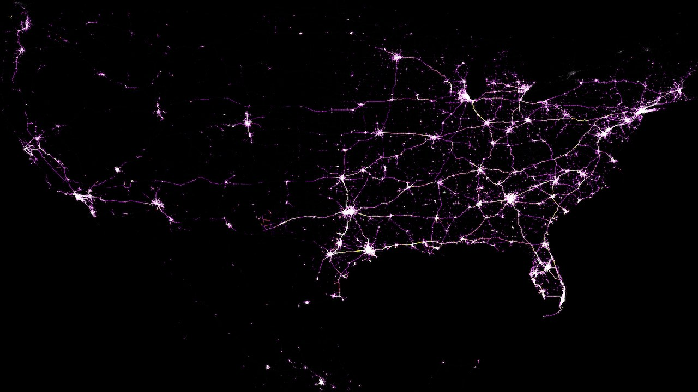

This research is aimed at simulating road travel for the entire continental 
United States using agent-level activity profiles derived from smartphone-based 
geospatial big data. The expansive spatial scope of this work allows for the estimation
of travel demand for an entire nation in one go. This work may be of value to 
transportation and planning agencies who are interested in estimating and predicting 
the system-wide travel demand.

The above figure shows the nationwide road congestion at 9 AM EST. Most of the east 
coast in the United States is busy with activity and the same holds for the Central 
time zone. However, activity levels are only higher in the big population centers on 
the West Coast as it is 6 AM for them.

## Research paper

Additional information can be found in the [research paper](https://www.researchgate.net/publication/337332041_Agent-based_modeling_to_simulate_road_travel_using_Big_Data_from_smartphone_GPS_An_application_to_the_continental_United_States):

Sashikanth Gurram, Vijayaraghavan Sivaraman, Jonathan T. Apple, Abdul R. Pinjari.
<em>Agent-based modeling to simulate road travel using Big Data from smartphone GPS: An application to the continental United States</em>.
2019.

### Abstract

Growing concerns about urban sustainability, economic and public health vitality, and 
climate change are common features across the world. Transportation is often inextricably
linked to these concerns and this necessitates the development of robust and scalable 
tools that can assist in timely understanding of the agent-system interactions. 
Such expedient but accurate analyses are critical for policymaking, especially in the 
current environment where urban mobility is witnessing a rapid transformation. 

To support such analyses, we demonstrate a novel methodology that implements a top-down 
large-scale agent-based simulation of urban travel using Global Positioning System (GPS) 
derived raw sightings. Specifically, we constructed the daily activity and travel 
patterns of devices (i.e. agents) using GPS data for a single day 
(Wednesday, March 6, 2019) for the entire continental United States. Data filtering 
techniques were applied to identify approximately 2.7 million smart devices (out of a 
daily total of 30.5 million) that were highly visible and mobile. We sourced roadway 
network data for the entire North America from Open Street Maps (OSM). We then fed the 
daily activity and travel records of agents along with the roadway network data into 
MATSim, an agent-based travel simulator, to produce highly spatiotemporally resolved 
agent activities along with their estimated travel trajectories. We processed these 
travel trajectories (1.5 billion records) to estimate vehicle miles traveled (VMT) 
for each U.S. state and modeled vehicle volumes per roadway link in the continental U.S.

Overall, we found strong rank correlations between our results and Federal Highway 
Administration’s VMT estimates, although absolute measures displayed a higher 
variability. We observed similar trends (i.e. low rank correlation errors but higher 
absolute errors) at the disaggregate roadway link level when comparing our extrapolated 
traffic volumes against roadway count station data from a select state (Florida). 
Finally, root mean squared error of our roadway volume estimates are comparatively 
similar to those for Florida’s regionwide travel demand models indicating a satisfactory 
model performance. 

The proposed methodology in our study demonstrates that such big data-powered 
large-scale agent-based simulations may provide value in estimating and predicting 
travel demand.